## 仓库地址
https://github.com/Tandayuan/docker-jenkins-study

## 学习目标

**学习环境：WSL2的Ubuntu**

+ [x] Docker、Docker-Compose安装与使用；
+ [x] Docker构建Jenkins容器和使用；
+ [x] Docker+Jenkins实现自动化部署前端项目；

## 参考资料

+ [Docker安装](https://docs.docker.com/engine/install/ubuntu/)、[DockerCompose安装](https://docs.docker.com/compose/install/linux/)

+ [Jenkins 系列教程-史上最简单Jenkins教程，教你一天学会使用Jenkins利器](https://blog.csdn.net/qq_32352777/article/details/109267847)

+ [解决Jenkins官方镜像包在构建Docker任务时报错的BUG](https://www.digitalocean.com/community/questions/docker-lib-x86_64-linux-gnu-libc-so-6-version-glibc_2-32-not-found-required-by-docker-how-to-solve)

+ [jenkins容器内生成 ssh 公钥连接Github](https://juejin.cn/post/6967243012199940110#heading-8)

## Docker、Docker-Compose安装与使用

+ 安装参照<a href="#参考资料">参考资料</a>中的官方文档链接
+ 查看是否安装成功：`docker version` `docker compose version`

## Docker构建Jenkins容器和使用

> 构建Jenkins源码参考`my_jenkins_build`文件夹中的文件；
>
> 请在Linux Ubuntu环境中按照以下步骤进行操作；
>
> compose.yaml文件中
>
> 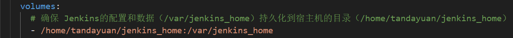
>
> `/home/tandayuan/jenkins_home`替换为真实Linux下的路径

### 复制win11Jenkins构建目录到Linux的指定目录命令操作过程

```bash
root@TanLAPTOP:/home/tandayuan## cp /mnt/d/tempDir/docker-jenkins-study/my_jenkins_build .
```

### 构建Jenkins镜像——Dockerfile

[点击打开Dockerfile查看详解](./my_jenkins_build/Dockerfile)

### 通过Docker Compose启动Jenkins镜像容器——compose.yaml

[点击打开compose.yaml查看详解](./my_jenkins_build/compose.yaml)

### sh脚本一键构建镜像和启动容器并成功访问Jekins——autoBuild.sh

> ps：chmod +x autoBuild.sh 赋予可执行权限

[点击打开autoBuild.sh查看详解](./my_jenkins_build/autoBuild.sh)

### Jenkins的简单使用

+ 目标：输出简单的Hello World

+ 启动脚本`./autoBuild.sh`，访问http://localhost:8085

+ 步骤：

  + 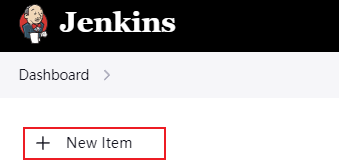
  + 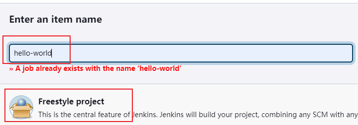

  + 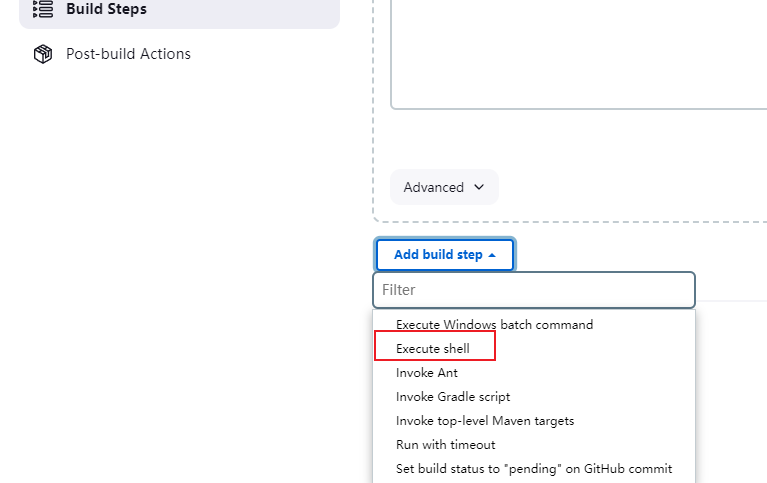

  + 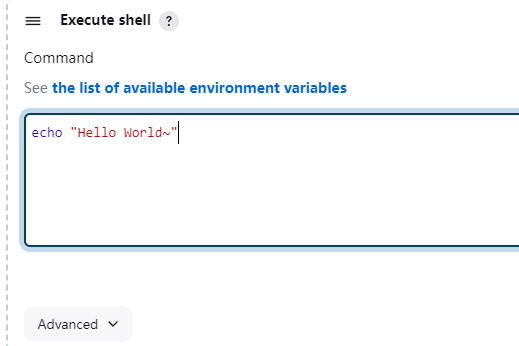

  + 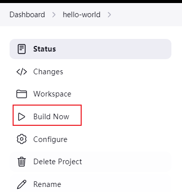

  + 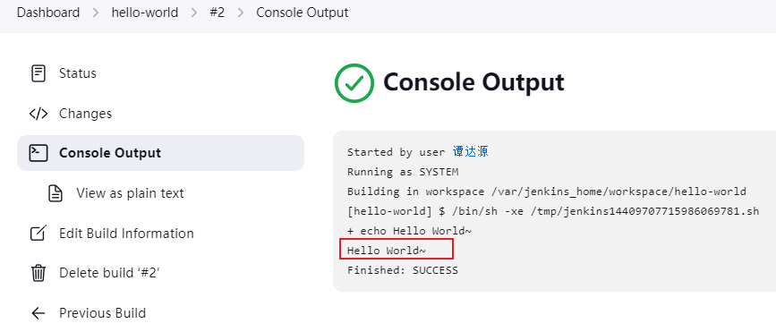

## Docker+Jenkins实现自动化部署前端项目

> 基于上一章节成功打开Jenkins后继续学习本章节

### 复制win11前端项目demo到Linux的Jenkins工作区目录命令操作过程

```bash
root@TanLAPTOP:/home/tandayuan## cp -r /mnt/d/docker-jenkins-study/mg-project ./jenkins_home/workspace/mg-project
root@TanLAPTOP:/home/tandayuan## cd ./jenkins_home/workspace/mg-project/
```

### Jenkins部署前端Demo和运行Demo查看效果

操作步骤：

+ 自定义Jenkins的工作目录：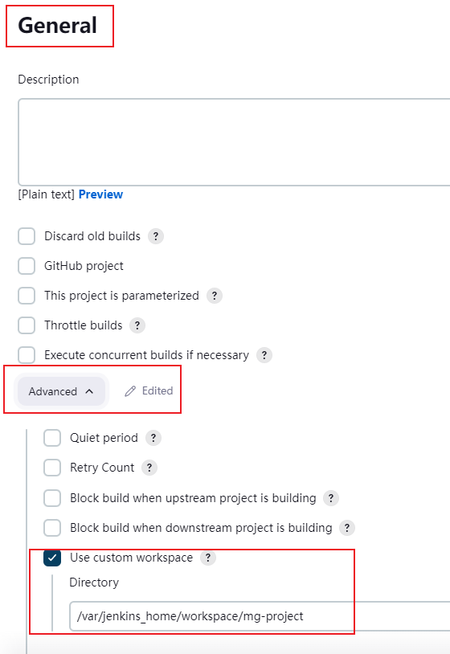

+ 指定一键部署脚本：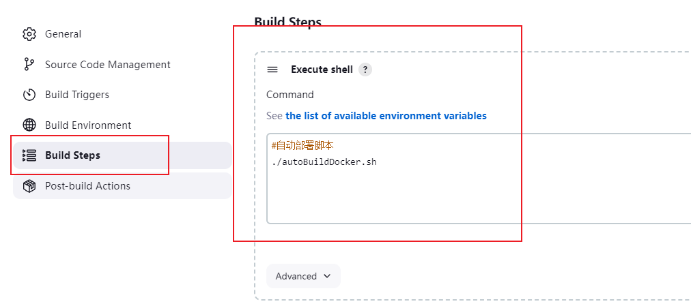

+ 执行Jenkins自动部署：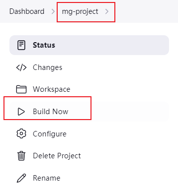

+ 打开浏览器访问查看效果：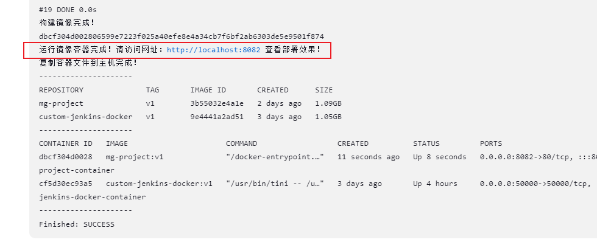

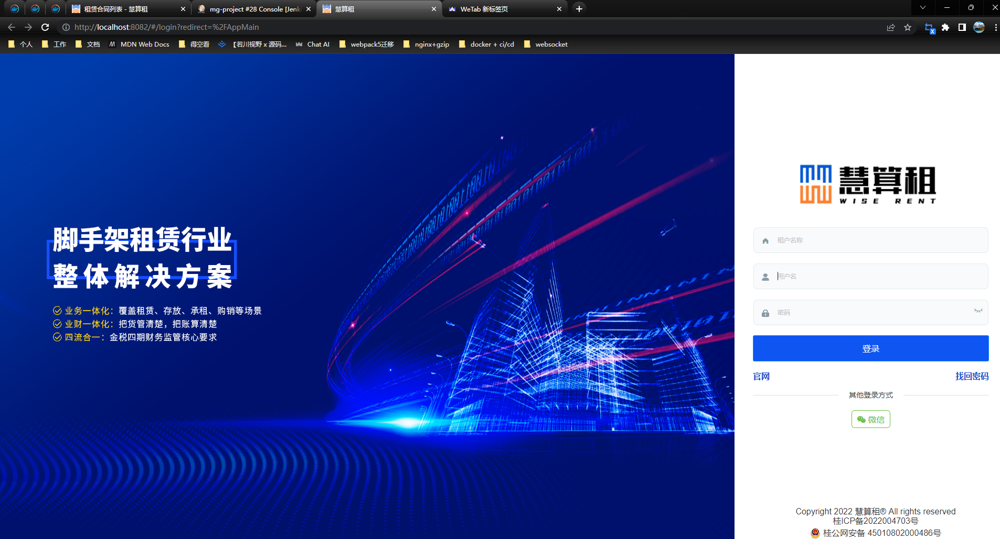

### 构建前端Demo镜像——Dockerfile

[点击打开](./mg-project/Dockerfile)

### sh脚本一键构建镜像和启动容器并成功访问前端Demo——autoBuildDocker.sh

[点击打开](./mg-project/autoBuildDocker.sh)

