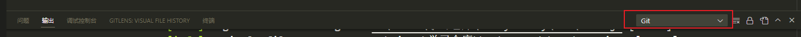

## 仓库地址
https://github.com/Tandayuan/husky-study
## 配合食用文章

[用 husky 和 lint-staged 构建代码检查工作流 - 知乎 (zhihu.com)](https://zhuanlan.zhihu.com/p/471039163)

[lint-staged 的 example 解读](https://www.npmjs.com/package/lint-staged)

## 学习目标

- 了解 GitHook 的作用 ✔

- 理解 husky 的原理 ✔
- 了解 lint-staged 的作用 ✔
- 学习 husky 和 lint-staged 以及 prettier、eslint 的结合使用 ✔
- prettier + eslint 利用 lint-staged + husky 统一代码风格 ✔

## GitHook

[Git 钩子文档](https://git-scm.com/book/zh/v2/自定义-Git-Git-钩子)

- Git 钩子是 Git 做重要动作前执行自定义脚本，比如在 git commit 时，会被 Hook 住，执行 Hook 的脚本再去执行 git commit 命令。在 git 中这种行为叫 pre-commit 钩子。
- 具体细节点击文档查看

## Husky

[Husky - Git hooks (typicode.github.io)文档](https://typicode.github.io/husky/#/)

- git 钩子脚本一般存在项目根目录中`.git/hooks`，`hooks`目录中又存在了`**.sample`的脚本文件。以`pre-commit.sample`为例，如果想要执行 pre-commit 的钩子，把写好的 sample 脚本后缀名去除掉(`pre-commit`)。只要脚本内容编译正确，那么执行 git commit 的操作前会预期先执行钩子中的脚本。
- 多人协作的团队项目中，由于`.git`都是忽略上传的, 只存在于本地中，所以 hook 脚本不能在团队中发挥作用。`husky`解决了上述的问题，它可以在项目中编写 githook 脚本并自动映射执行 githook 操作和能上传脚本到 git 仓库中统一应用项目成员的脚本。

- 安装和配置教程看文档

- 踩坑：

  - 低版本 Node(15>version)执行如下命令会不生效

  ```shell
  npx husky add <file> [cmd]
  ```

  解决方案：先通过命令添加脚本文件到`.husky`目录中，目录找到相应的 file 脚本文件，手动添加需要执行的 shell 命令。

  ```shell
  npx husky add <file>
  ```

  `.husky/pre-commit`

  解析：git commit 时会先执行 pre-commit 钩子脚本里的 shell 命令`npx eslint --fix .`再执行`git commit`

  ```shell
  #!/usr/bin/env sh
  . "$(dirname -- "$0")/_/husky.sh"
  # 以下是手动添加的：
  npx eslint --fix .
  ```

  - 高版本 Node 直接命令添加即可

## lint-staged

[lint-staged 文档地址](https://www.npmjs.com/package/lint-staged)

- 在使用 Husky 执行钩子脚本`npx eslint --fix .`，会对所有文件都 eslint 代码检查一遍，对于大型项目来说好使会很久很不友好。`lint-staged`解决以上问题，它会在代码暂存区中依据配置文件中指定的目录执行指定的脚本，减少项目提交到仓库的耗时。
- 安装和配置

- 配置文件`.lintstagedrc`

  ```json
  {
    "src/**/*.{js,ts}": ["npx eslint --fix ."]
  }
  ```

## husky、lint-staged 结合使用

- 前提：安装并且配置好这两玩意、prettier 和 eslint 已经结合使用。

- 修改 husky 的`pre-commit`脚本文件为例：

  - 钩子脚本会执行`lint-staged`

  ```shell
  npm run lint-staged
  ```

  - `lint-staged`读取`.lintstagedrc`配置文件：
    - `.lintstagedrc`读取暂存区中 src 中 js 或 ts 文件，对这些文件执行以下 shell 命令：`npx eslint --fix .` `echo 'from eslint-staged~'`
    - 第一个命令是 eslint 检查并修复暂存区中的相关文件
    - 第二个命令是在控制台输出 from eslint-staged~字符串

  ```shell
  {
      "src/**/*.{js,ts}": [
        "npx eslint --fix .",
        "echo 'from eslint-staged~'"
      ]
  }
  ```

  - 以上命令的执行结果可以在 Git 控制台中看到

    

## prettier + eslint 利用 lint-staged + husky 统一代码风格

- 原理：glob 模式匹配到对应的文件，然后根据 prettier 或者 eslint 命令去统一匹配到的文件风格。

  `.lintstagedrc`

  解读：

  - 匹配到 src 目录下所有 js 或者 ts 文件在 git 暂存区时，执行 eslint 配置统一代码风格。
  - 匹配到项目所有目录下所有非 js 或者非 ts 文件在 git 暂存区时，执行 prettier 配置统一代码风格。

  ```json
  {
    "src/**/*.{js,ts}": ["eslint --fix", "echo 'eslint格式化中~'"],
    "!(*.{js,ts})": ["prettier --write", "echo 'prettier格式化中~'"]
  }
  ```
