# js关于双精度浮点型知识

## 仓库地址
https://github.com/Tandayuan/js-float-study

## 参考资料

> [0.1+0.2等于0.3吗](https://juejin.cn/post/6927217000112455687)
>
> [计算机组成原理 | 为什么浮点数运算不精确？（阿里笔试）](https://juejin.cn/post/6860445359936798734)
>
> [普通进制转换工具网](https://www.sojson.com/hexconvert.html)
>
> [IEEE754标准的浮点数转换网](https://www.toolhelper.cn/Digit/FractionConvert)

## 学习目标

+ [x] 学习字节、字、位、比特的概念和关系

+ [x] 学习js双精度换算原理以及小数丢失精度原因
+ [x] 了解小数精度丢失带来的bug以及处理方案
+ [x] 学习整数、小数、整数＋小数的二进制、十进制互相转换

## 学习字节、字、位、比特的概念和关系

> 参考文章：[学习字节、字、位、比特的概念和关系](https://blog.csdn.net/qq_28351609/article/details/84574349)

+ 位：bit 中文谐音 比特 1bit = 1位 = 1比特；位是计算机中数据的最小存储单位，表示二进制位。1位只能表示一个二进制的0或1。

  > 8位能表示的最大的无符号数据量是：
  >
  > 二进制：11111111
  >
  > 十进制：利用换算公式 2^8 = 256

+ 字节：byte 中文谐音 拜特 1byte = 1字节 = 8比特；字节是计算机中数据处理的基本单位。

+ 字：word ；1个字由多个字节构成，计算机的字长决定了其CPU一次操作处理实际位数的多少，由此可见计算机的字长越大，其性能越优越。

## 学习js双精度换算原理以及小数丢失精度原理

> js采用的是IEEE754的双精度浮点标准存储Number类型的值，包括整数、小数、整数+小数。
>
> 定点数与浮点数的定义和区别：
>
> 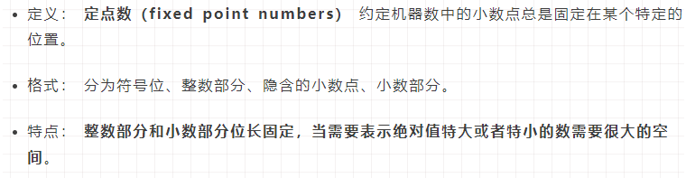
>
> 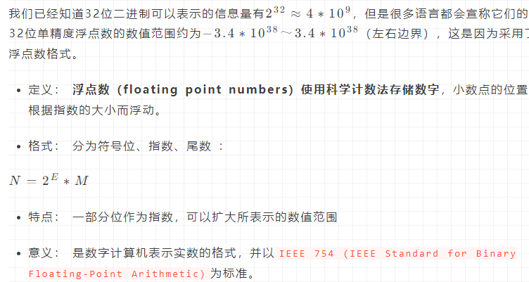
>
> 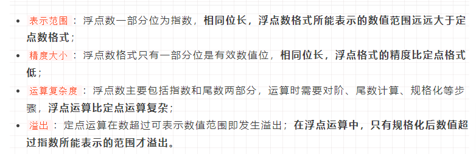
>
> 对比总结：浮点数表示范围更广、运算复杂度更高，但精度没那么高。

### js双精度换算原理：

> 转换流程：十进制 转 普通二进制 转 二进制科学计数法 转  IEEE 754标准浮点数的二进制和十进制

+ 十进制：

  以十进制0.1为例

+ 普通二进制：

  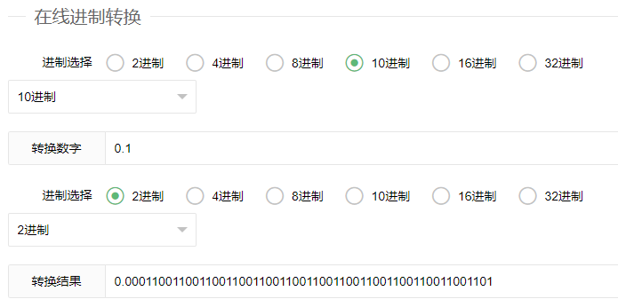

  0.1转成二进制是一个无限循环的数，它会无限循环0011。

+ 二进制科学计数法：

  规格化的二进制科学计数表示法要把小数点移动到1的后面，得到的指数就是**偏移量**。

  `0.0001100110011001100110011001100110011001100110011001101....`向右移动4位得出二进制科学计数法表示：`1.100110011001100110011001100110011001100110011001101.... * 2^-4` 

  **偏移量 = -4**

+ IEEE 754标准浮点数二进制：

  > 涉及公式：
  >
  > 阶数 = (2^e-1) - 1 其中e是指数域的值 双精度指数域的值是11；(2^11-1) - 1
  >
  > 指数位 = 阶数 + 偏移量

  不同精度的浮点数指标：

  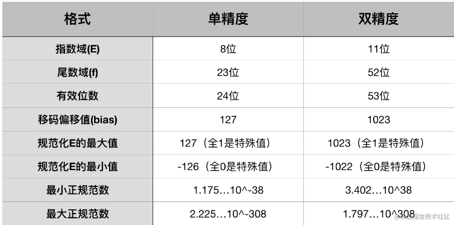

  浮点数二进制组成：

  符号位与二进制一致；0 正数 1 负数

  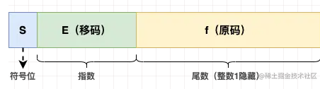

  **指数位计算：**

  指数位 = 阶数 + 偏移量 = ( (2^11-1) - 1 )+ (-4) = 1019

  10进制1019 转 2进制得到：1111111011 由于双精度指数域位数要求是11位，最高位补0。最终**指数位 = 01111111011**

  **尾数位计算：**

  小数位为100110011001......，因为小数位只能保留52位，第53位为1故进1。

  **双精度浮点数二进制表示：**

  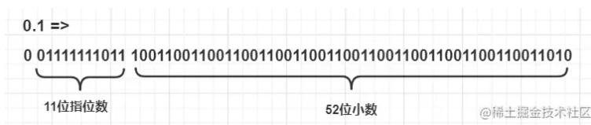

+ IEEE 754标准浮点数十进制：

  > 2转10公式：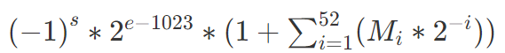
  >
  > s是符号位 0正数 1负数；e是指数位的十进制；M是二进制尾数位的数

  e = 01111111011 转十进制 = 1019

  s = 0

  `(-1)^0 * 2^1019-1023 * (1+1*2^-1+0*2^-2+0*2^-3+1*2^-4……)`

  以上计算结果是：Decimal(exact)是0.1的双精度浮点数的十进制表示

  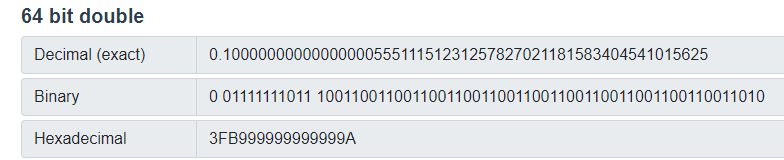

#### 通过以上原理知道0.1+0.2 != 0.3的原因：

0.1和0.2转换成双精度浮点数二进制：

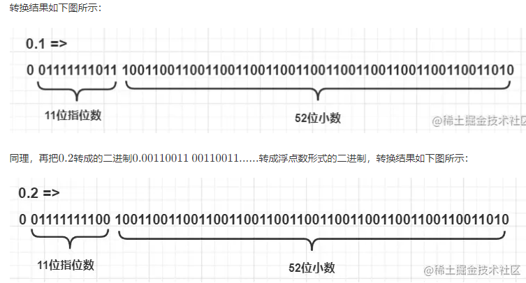

双精度浮点数相加：

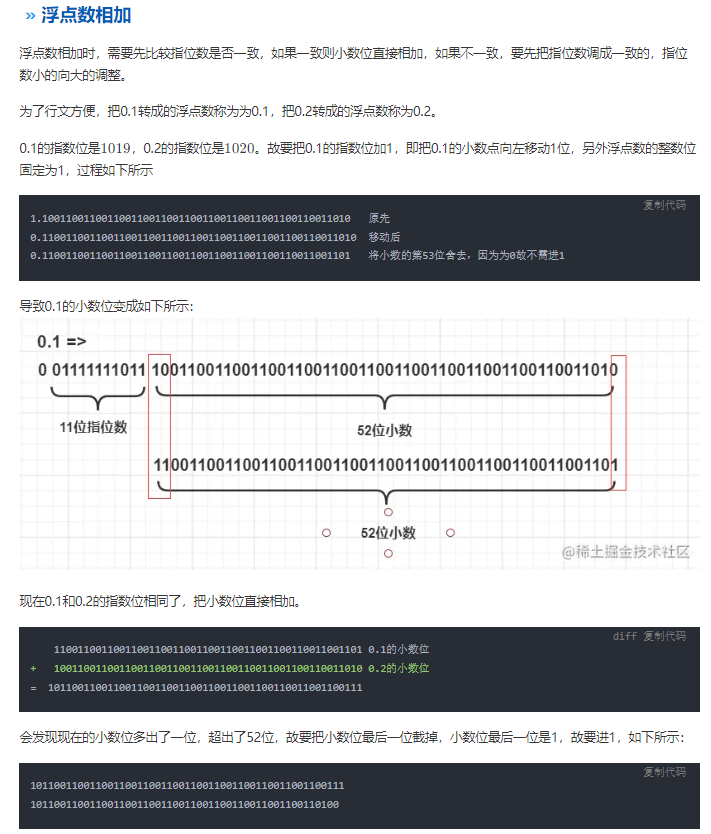

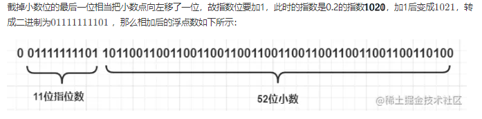

结果转十进制：

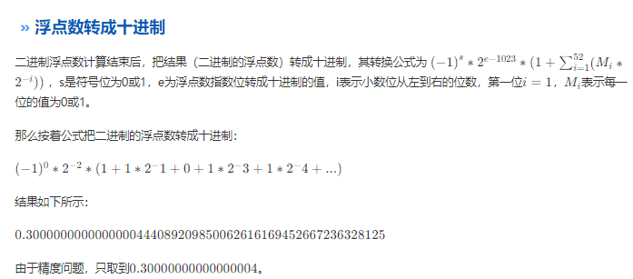

### 小数丢失精度原因：

+ 小数在转换过程中发生了两次精度丢失，第一次——十进制转普通二进制，由于得到的是无限循环得到的值不可能是精确的；第二次——二进制科学计数法 转  IEEE 754标准浮点数的二进制，因为双精度浮点数的尾数位长52，截取之前得到的二进制数位长，再次发生精度丢失。

## 了解小数精度丢失带来的bug以及处理方案

+ 造成页面数值混乱BUG：

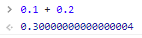

+ 解决方案：

  保留小数点，四舍五入取值。

  具体：比如保留2位小数的情况，number转换string，利用API把判断小数点后第三位的值，知道是否四舍五入。利用Api*100小数点后移两位后取整。根据之前四舍五入的情况选择是否+1，再/100前移两位得到结果。

+ 解决方案代码：

  ```js
  Number.prototype.toFixed = function(length)
  {
      if(!length || (length < 0 || length > 20)) length = 0;
      var carry = 0; //存放进位标志
      var num,multiple; //num为原浮点数放大multiple倍后的数，multiple为10的length次方
      var str = (this) + ''; //将调用该方法的数字转为字符串
      var dot = str.indexOf("."); //找到小数点的位置
      if(dot > 0 && str.substr(dot+length+1,1)>=5) carry=1; //找到要进行舍入的数的位置，手动判断是否大于等于5，满足条件进位标志置为1
      multiple = Math.pow(10,length); //设置浮点数要扩大的倍数
      num = Math.floor(this * multiple) + carry; //去掉舍入位后的所有数，然后加上我们的手动进位数
      var result = num/multiple + ''; //将进位后的整数再缩小为原浮点数
      /*
      * 处理进位后无小数
      */
      dot = result.indexOf(".");
      if(dot < 0 && length!==0){
          result += '.';
          dot = result.indexOf(".");
      }
      /*
      * 处理多次进位
      */
      var len = result.length - (dot+1);
      if(len < length){
          for(var i = 0; i < length - len; i++){
              result += 0;
          }
      }
      return result;
  }
  // 思考，整数情况下。
  const num = 9999999998.9999949999999999999999999999999999999;
  // const num = -3.000;
  const num2 = num.toFixed(5);
  console.log(num2)
  ```

## 学习整数、小数、整数＋小数的二进制、十进制互相转换

> 10转2：
>
> 整数部分：除2取余法；小数部分：乘2取整法
>
> 2转10：
>
> 按权相加法；

**除2取余法：**

```
例：将十进制的168转换为二进制

得出结果 将十进制的168转换为二进制，（10101000）

分析:

第一步，将168除以2,商84,余数为0。

第二步，将商84除以2，商42余数为0。

第三步，将商42除以2，商21余数为0。

第四步，将商21除以2，商10余数为1。

第五步，将商10除以2，商5余数为0。

第六步，将商5除以2，商2余数为1。

第七步，将商2除以2，商1余数为0。

第八步，将商1除以2，商0余数为1。

第九步，读数，因为最后一位是经过多次除以2才得到的，因此它是最高位，读数字从最后的余数向前读，即10101000
```

**乘2取整法：**

即将小数部分乘以2，然后取整数部分，剩下的小数部分继续乘以2，然后取整数部分，剩下的小数部分又乘以2，一直取到小数部分为零为止。如果永远不能为零，就同十进制数的四舍五入一样，按照要求保留多少位小数时，就根据后面一位是0还是1，取舍，如果是零，舍掉，如果是1，向入一位。换句话说就是0舍1入。读数要从前面的整数读到后面的整数。

```
下面举例：

例1：将0.125换算为二进制

得出结果：将0.125换算为二进制（0.001）

分析:

第一步，将0.125乘以2，得0.25,则整数部分为0,小数部分为0.25。

第二步, 将小数部分0.25乘以2,得0.5,则整数部分为0,小数部分为0.5。

第三步, 将小数部分0.5乘以2,得1.0,则整数部分为1,小数部分为0.0。

第四步,读数,从第一位读起,读到最后一位,即为0.001。

例2：将0.45转换为二进制（保留到小数点第四位）

大家从上面步骤可以看出，当第五次做乘法时候，得到的结果是0.4，那么小数部分继续乘以2，得0.8，0.8又乘以2的，到1.6这样一直乘下去，最后不可能得到小数部分为零，因此，这个时候只好学习十进制的方法进行四舍五入了，但是二进制只有0和1两个，于是就出现0舍1入。这个也是计算机在转换中会产生误差，但是由于保留位数很多，精度很高，所以可以忽略不计。

那么，我们可以得出结果将0.45转换为二进制约等于0.0111

上面介绍的方法是十进制转换为为二进制的方法，需要大家注意的是：

十进制转换为二进制，需要分成整数和小数两个部分分别转换。

当转换整数时，用的除2取余法，而转换小数时候，用的是乘2取整法。

注意他们的读数方向。

因此，我们从上面的方法，我们可以得出十进制数168.125转换为二进制为10101000.001
```

**按权相加法：**

即将二进制每位上的数乘以权，然后相加之和即是十进制数。

```
将二进制数101.101转换为十进制数。

得出结果：（101.101）2=(5.625)10
1*2^2 + 0*2^1 + 1*2^0 = 5
1*2^-1 + 0*2^-2 + 1*2^-3 = 0.625
5 + 0.625 = 5.625
```

