# 学习和分析Koa洋葱模型的实现

## 仓库地址
https://github.com/Tandayuan/koa-simple-study

## 参考文章、仓库

> + 参考文章1：[若川-50行代码串行Promise，koa洋葱模型原来是这么实现？](https://juejin.cn/post/7005375860509245471#heading-11) 
> + 参考文章2：https://juejin.cn/post/7160681567348588580/#heading-6
> + 模板仓库：https://github.com/lxchuan12/koa-compose-analysis

## 学习目标

+ [x] 学习克隆和保留 `compose` 仓库的 `git` 记录
+ [x] 调试和分析koa-compose代码
+ [x] 学习高阶函数概念
+ [ ] 学习手动创建调试配置文件luaunch.json
+ [x] 比较node的promisify模式与koa洋葱模型的相似点

## 学习克隆和保留 `compose` 仓库的 `git` 记录

1. git上新建一个仓库

2. clone到本地，在仓库目录打开git命令窗口操作

3. ```
   git subtree add --prefix=compose https://github.com/lxchuan12/koa-compose-analysis
   ## 解读：本地仓库目录新建一个compose文件夹，克隆目标仓库的代码到compose中。

## 调试和分析koa-compose代码

> 目的：理解洋葱模型的执行流程和好处

### 调试should work测试用例

+ package.json开启jest的调试，被测试的it/test对象后增加only可以只对当前用例调试，避免其他用例干扰。

  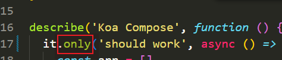

+ 调试`should work`用例，在`await compose(stack)({})`提前打好断点，F11进入源代码调试。

+ 跳转到`index.js`  在33行打断点再F5跳到指定位置，可以跳过校验数组元素类型的循环。

  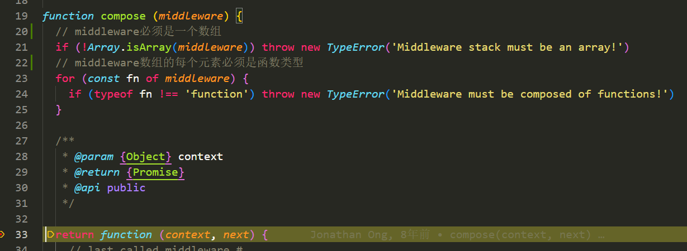

+ 在`return *Promise*.resolve(fn(*context*, dispatch.bind(null, *i* + 1)))`打个断点，F5跳转到断点处，再F11单步调试跟踪代码执行。

+ 跟踪到第一个中间件函数，一直往下执行到24行的next()，F11单步调试跟踪。

  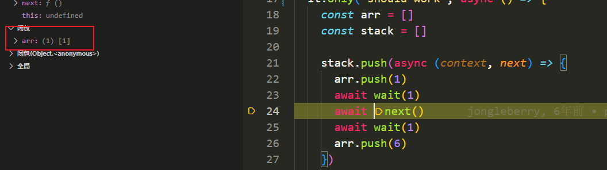

  + 可以看出next()执行的就是dispatch()，i的值是1。

    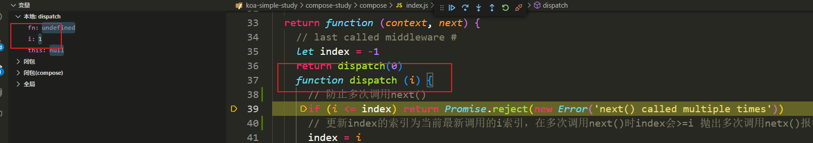

  + 得出结论：执行middleware数组中的中间件函数，将dispatch高阶函数的参数预设为i+1，目的是准备好中间件数组索引是i+1的函数，等待每个中间件函数的第二个参数next调用。触发dispatch(i+1)，依次类推，像一个递归的行为。

    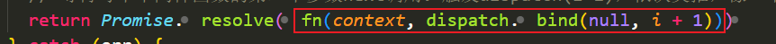

+ 按照上一步骤的调试方法进行剩余的调试。

+ 调试完这个测试用例后得出源码结论：

  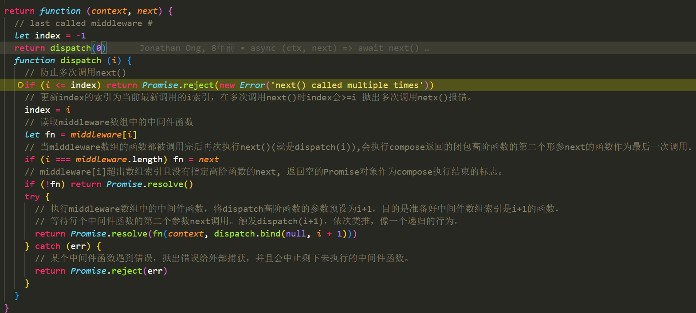

+ 通过调试发现代码的执行流程是如下的：

  类似于一个洋葱的形状，代码是由外到内执行，执行完成后再由内到外执行剩下的代码。

  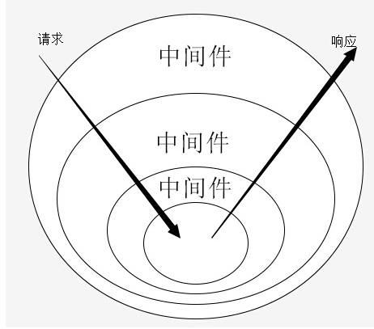

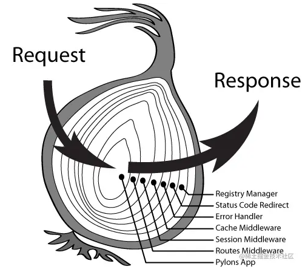

+ 由下图分析可知，由外到内依次执行上半区的代码再由内到外执行下半区的代码，形成一个洋葱模型


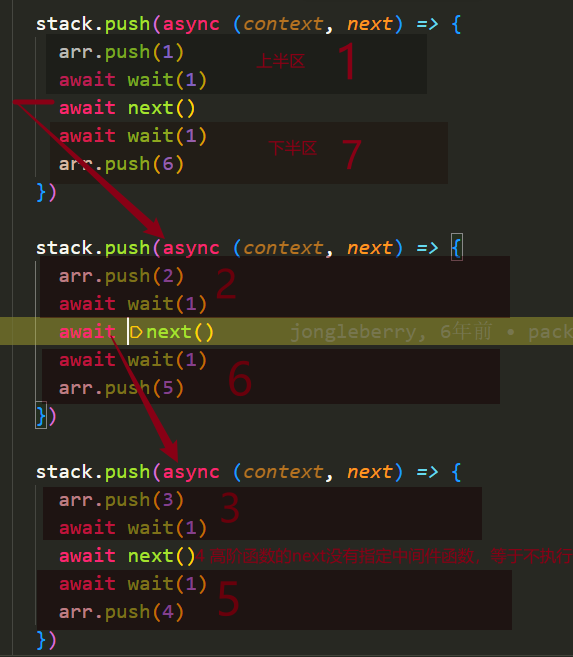

### 调试should throw if next() is called multiple times测试用例

+ 断点第二个next()，模拟多次执行next

  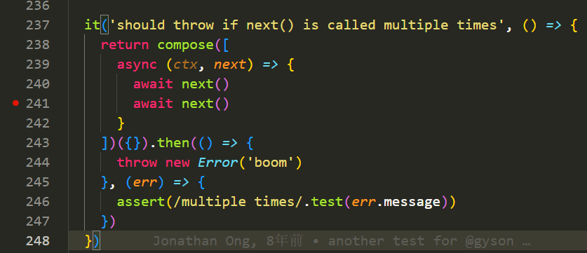

  ps：开启断点调试后再往next断点，F5使小黄标指在next前再F11才能进到源码调试查看。

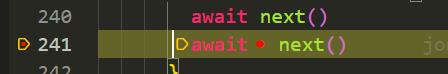

+ 第一次调用next更新了index的值，当多次调用next，会抛出对应错误。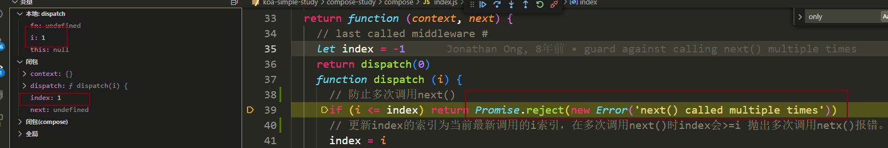

### 调试should catch downstream errors测试用例

+ 下游中间件函数报错的时候上游可以捕获到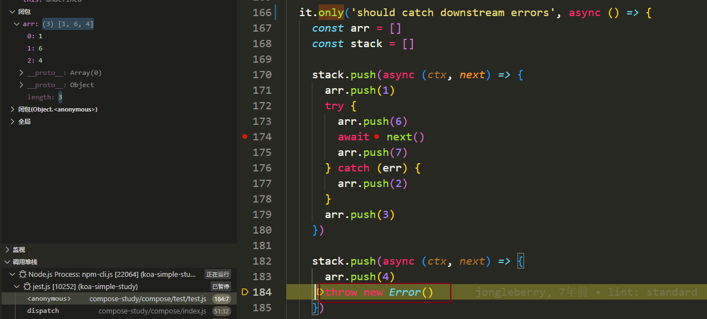

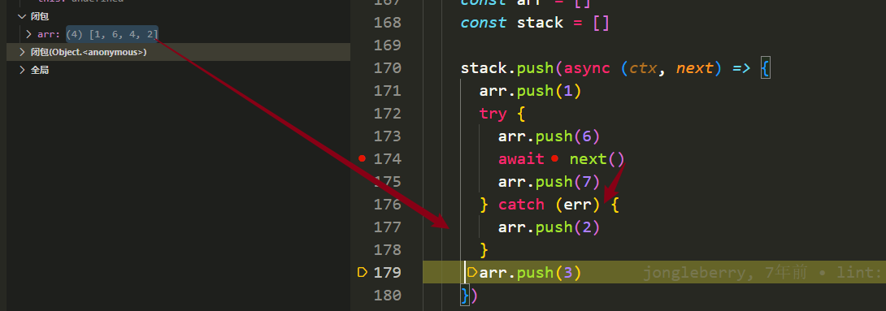

## 学习高阶函数概念

> 高阶函数是一个可以接收函数作为参数，甚至返回一个函数的函数。 它就像常规函数一样，只是多了接收和返回其他函数的附加能力，即参数和输出。

+ [高阶函数概念](https://zhuanlan.zhihu.com/p/49579052)

## 比较node的promisify模式与koa洋葱模型的相似点

> node promisify小用例的代码链接：
>
> https://github.com/Tandayuan/remote-git-tags-study/tree/8342438ad589c8dd6b5ca7a590ea35b8b98f4534/src/promisify
>
> 其中：
>
> testPromisifyCase.html 是实际例子
>
> main.ts 实现Promisify的源码
>
> loadImage.js 符合Promisify规范的函数
>
> promisify的作用是将一个包含回调或者异步的函数转换为以async await的形式执行的函数。转换后的函数可以等待函数内的回调或者异步的函数执行完毕再同步继续执行上下文环境中的代码。具体的例子看testPromisifyCase.html。

+ 相似点：都是利用Promise 和 async await串行同步执行异步函数，都可以捕获下游函数的错误。