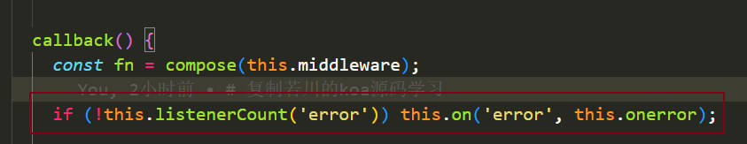

# Koa整体架构学习

## 仓库地址
https://github.com/Tandayuan/koa-simple-study

## 学习参考仓库、文章

> + 文章：https://juejin.cn/post/6844904088220467213
> + 仓库：https://github.com/lxchuan12/koa-analysis

## 学习目标

+ [x] 简单调试了解koa代码整体执行的顺序流程，学习koa相关涉及知识。
+ [x] demo调试，弄清楚koa到底干了啥。
+ [x] 学习generate函数的执行流程。
+ [x] 学习koa-convert、co的原理。

## 简单调试了解koa代码整体执行的顺序流程

### 大体流程：

因为是在nodeJs环境中调试的，无法打开浏览器，因此调试无法进行到监听服务器事件的回调函数中，只能简单的梳理大体执行流程。

+ 找到调试文件目录，在30行打下断点，F5开启调试模式。

  

+ 利用node的http创建了个静态服务器，添加监听回调函数callback()。检测到3000的端口地址被打开，执行callback()。

  

+ callback是一个高阶的回调函数，其实回调执行的是handleRequest方法。利用之前所学到的koa-compose接收一个middleware数组，返回的fn函数对象和上下文ctx对象被传入handleRequest函数中进一步处理执行。

  

  + middleware数组来自use()传入的中间件函数组成

    

  + ctx是一个中间件共享的对象，里面包含了请求和响应等http协议的数据对象，具体通过createContext函数实现。

    

+ handleRequest以ctx作为共享对象，传入并执行了middleware数组中的所有中间件函数（具体体现：fnMiddleware(*ctx*)函数），并在执行完后把响应体等数据返回给调用者（具体体现：handleResponse函数），还有对中间件的错误进行了捕获处理（具体体现：.catch(onerror)）。

  

+ koa简单的执行流程大体如上进行。

### 重点关注实现：

+ 错误捕获方面：

  + Koa继承一个事件类获得捕获到错误后分发错误有关信息给订阅者的能力

  

  + Koa全局错误订阅者在没有指定下默认实现；可通过`app.on('error', errorCallBack)`定义Koa全局错误订阅者。

  

  + 中间件错误捕获函数：在中间件执行过程中如有发生错误，并在中间件函数中没有进行trycatch或者在trycatch中catch里再次throw一个错误对象的前提下，onerror这个捕获函数都能够捕获到发生的错误，对错误给调用者不同形式的反馈。

    > 如果在中间件函数中进行trycatch并在catch中没有再次throw一个错误对象会是怎么样？
    >
    > 如下图所示：
    >
    > 
    >
    > 在一个中间件函数中捕获并处理错误后：
    >
    > 1. 不会继续往下执行剩下的中间件。因为根据koa-compose的源码得知：
    >
    > 
    >
    > 2. 会直接执行then中的回调函数handleResponse，不会执行catch的。因为在中间件捕获完成后没有再次抛出错误让catch捕获到。
    >
    > 
    
    + ps：这里的this指的是调用onerror的ctx对象
    
      
    
    + 反馈一：发布错误信息给Koa全局错误订阅者
    
    
    
    + 反馈二：在中间件函数共享对象ctx的res对象中传入msg
    
    

​	 

+ 共享上下文对象cxt的实现：

  

  + 通过以context.js为原型构造一个新的对象this.context

  

  

  

  + 又通过this.request和this.response为原型进一步构造context对象


最终构造出包含有请求、响应对象结构的上下文cxt对象，为中间件函数提供了许多可用的数据去拓展他们的能力。

## demo调试，弄清楚koa到底干了啥

### 找到调试位置，开启调试

+ 调试入口文件：

  

+ 调试demo：

​	

+ 魔改的koa.js（模拟http环境以及去除不必要的校验和转换，核心思路不变）：

  

+ koa-compose.js :

  

+ 执行命令，创建http服务器，浏览器在线调试

  ```bash
  pnpm add -g http-server
  cd koa-framework-study/koa/examples/simpleKoa
  http-server -p 8080
  ```

+ 浏览器打断点进行调试

  

### 执行流程

+ use()：所有传进use的中间件函数存放到this.middleware数组

  

+ listen(): 

  + 获取当前的上下文：

  

  + 按洋葱模型的顺序执行所有的中间件函数

    

  + 断点执行第一个中间件函数：通过next（）进入第二个

    

  + 进入第二个断点中间件函数：通过next（）进入第三个

    

  + 进入第三个断点中间件函数：

    

  + 执行完第三个后，跳出回到第二个继续执行：

    

    + 控制台打印出上下文部分信息：

      

  + 执行第二个后，跳出回到第一个继续执行：

    

    + 调用函数设置X-Response-Time字段值，控制台打印信息：

      

      

  + 所有中间件函数执行完成，执行响应体函数：

    

    

    + 控制台显示响应体信息：

      

  + 全流程得到的信息：与调试时显示的信息一致，因为调试与不调试的有关时间计算有出入，控制台部分信息不一样属于正常现象。

    

## 学习generate函数的执行流程。

> 文档资料：
>
> [generator函数学习文档 - yield](https://developer.mozilla.org/zh-CN/docs/Web/JavaScript/Reference/Operators/yield)
>
> [generator函数学习文档 - next](https://developer.mozilla.org/zh-CN/docs/Web/JavaScript/Reference/Global_Objects/Generator/next)
>
> 重点运用的知识：
>
> 一旦遇到 `yield` 表达式，生成器的代码将被暂停运行，直到生成器的 `next()` 方法被调用。每次调用生成器的 `next()` 方法时，生成器都会恢复执行，直到达到以下某个值：
>
> - `yield`，导致生成器再次暂停并返回生成器的新值。下一次调用 `next()` 时，在 `yield` 之后紧接着的语句继续执行。
> - 到达 [`return`](https://developer.mozilla.org/zh-CN/docs/Web/JavaScript/Reference/Statements/return) 语句。在这种情况下，生成器的执行结束，并将 `IteratorResult` 返回给调用者，其 `value` 的值是由 `return` 语句指定的，并且 `done` 为 `true`。
>
> **警告： 不幸地是，`next()` 是不对称的，但这并不是没有帮助：它总是向当前暂停的 `yield` 发送一个值，但是返回的是 `yield` 之后表达式的运算结果。**

### demo代码

```javascript
function* counter(value, fn) {
  let step
  // 这一行假设接收第一次next(value)的value值，继续往下...
  step = yield value++;
  if (step) {
    value += step;
  }
  step = yield ++value;
  if (step) {
    value += step;
  }
  step = yield value++;
  if (step) {
    value += step;
  }
  step = yield value++;
  if (step) {
    value += step;
  }
  step = yield value++;
  if (step) {
    value += step;
  }
  step = yield value++;
  if (step) {
    value += step;
  }
  step = yield value++;
  fn(value)
  return "TDY" + step;
}
const generatorFunc = counter(0, (value)=>{console.log("最终的value：", value)}); // console.log("最终的value", value) // 27
console.log(generatorFunc.next("虚空给值").value); // 0
console.log(generatorFunc.next().value); // 2
console.log(generatorFunc.next().value); // 2
console.log(generatorFunc.next().value); // 3
console.log(generatorFunc.next(10).value); // 14
console.log(generatorFunc.next().value); // 15
console.log(generatorFunc.next(10).value); // 26
const lastNext = generatorFunc.next("加油~")
console.log(lastNext.value); // TDY加油~
console.log(lastNext.done ? "执行OK" : null); // "执行OK"
```

### 断点调试解析代码

+ 断点位置图示：

  

+ 第1个next解析：

  

  

  > 执行完成结果：
  >
  > 生成器的value：0；done: false
  >
  > counter函数的value：1；step: undefind

+ 第2个next解析：

  

  

  > 执行完成结果：
  >
  > 生成器的value：2；done: false
  >
  > counter函数的value：2；step: undefind

+ 第3个next解析：

  调试思路与第2个next解析一致

  

  

  > 执行完成结果：
  >
  > 生成器的value：2；done: false
  >
  > counter函数的value：3；step: undefind

+ 第4个next解析：

  调试思路与第2个next解析一致

  

  

  > 执行完成结果：
  >
  > 生成器的value：3；done: false
  >
  > counter函数的value：4；step: undefind

+ 第5个next解析：

  

  

  > 执行完成结果：
  >
  > 生成器的value：14；done: false
  >
  > counter函数的value：15；step: 10

+ 第6个next解析：

  调试思路与第2个next解析一致

  

  

  > 执行完成结果：
  >
  > 生成器的value：15；done: false
  >
  > counter函数的value：16；step: undefind

+ 第7个next解析：

  调试思路与第5个next解析一致

  

  

  > 执行完成结果：
  >
  > 生成器的value：26；done: false
  >
  > counter函数的value：27；step: 10

+ 第8个next解析：

  

  

  

  

+ 根据以上思路调试，可以理解generate函数的执行流程~

## 学习koa-convert、co的原理。

> koa-convert 是 koa-1版本的实现核心，它的作用是让Generate类型函数自动执行、返回结果转换成Promise对象。koa-convert的特性让koa-compose无脑传入中间件函数，不需要担心函数不兼容问题。
>
> 附koa源码引用koa-convert的地方：
>
> 
>
> koa-convert的转换核心实现是在co实现的，所以大部分调试都在co进行。
>
> 关于co的实现原理由浅到深，参考koa/examples/co-generator的例子调试理解。
>
> 本章节做的是koa、koa-convert、co、koa-compose整体的调试。

### 调试和分析代码

+ demo入口文件和涉及文件

  + 利用http-server打开html、浏览器F12断点调试

  

### koa-convert的调试

+ 断点图

  

+ 核心实现：

  convert把generator函数改造成符合compose接参形式的普通函数，普通函数中的co负责实现它的职责(co调试会说明)。

  

  

  经过转换后的等效函数如图：

  

### co调试

+ 断点图：

  > 因为由上一章调试，我们知道执行这个中间件函数会先index.js的17行处，因此打个断点。之后在co.js中打断点，67和71行是核心实现，因此必须打好断点让调试工具跟着断点走，否则在co函数开头直接打断点会丢失很多细节。

  index.js

  

  co.js：

  

+ 首次调试：

  刷新浏览器页面后，F8按一次断点到此处。往后都是F11慢慢看细节和过程。

  

+ co.js第1次执行 onFulfilled()

  由于我们断好了点，所以onFulfilled()执行以后默认从67行开始调试。

  + ret = gen.next(res)执行：

  

  + ret = gen.next(res)执行执行结束后的控制台信息：

  

  + next(ret)执行：

    执行到高亮行，ret.value是createGenerator的生成器，因此通过toPromise递归执行co，co会自动执行createGenerator生成器的next()，再把函数返回值转换成Promise对象，这就符合koa-compose的中间件函数规范了。

    

+ 第2次

  

  

  

  + ret = gen.next(res)执行：

  

  

  + ret = gen.next(res)执行执行结束后的控制台信息：

  

  + next(ret)执行：

    

+ 总结：

  

  所有中间件函数都执行完后，返回响应体数据给控制台：

  

  

+ 完整的控制台信息：

  

+ 调试结束
