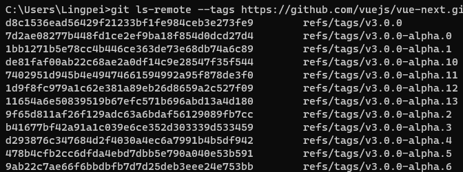

# callback promisify 化的 Node.js 源码实现

## 仓库地址
https://github.com/Tandayuan/remote-git-tags-study

## 配合食用文章
https://juejin.cn/post/7028731182216904740

## 学习目标

+ 学会调试看代码 ✔
+ 学习git仓库获取所有tags的原理 ✔
+ 学习用到的NodeJsApi ✔
+ 理解Node的Promisify思想和封装简单的Promisify规范的函数 ✔
+ 学习JS的Map和应用场景 ✔
+ 学习Reflect.apply() ✔
+ 尝试学习windows的shell命令和编写简单的脚本 ✔

## 获取仓库标签原理

cmd命令： `git ls-remote --tags 仓库URL地址`获取某个仓库的标签名和Hash值，把这些tags存储在Map对象中。

## Map对象的学习

[Map的MDN文档](https://developer.mozilla.org/zh-CN/docs/Web/JavaScript/Reference/Global_Objects/Map/forEach)

主要学习方向：Map与Object的不同之处，思考什么场景下更适合Map对象。

## 用到的NodeJsApi

[promisify文档](http://nodejs.cn/api-v16/util.html#utilpromisifyoriginal)

[execFile文档](http://nodejs.cn/api-v16/child_process.html#child_processexecfilefile-args-options-callback)

execFile是一个符合promisify规范的函数，能够创建子进程，异步地执行一个系统命令。

如果execFile方法中有`AbortController`中止进程，需要nodeJs版本>=v15.4.0。

## Promisify的简单封装和使用场景

+ `src\promisify\main.ts`是封装promisify的源代码
+ `src\promisify\loadImage.js`是符合promisify规则的函数
+ 核心思想：利用Promise对象只有决议或者拒绝后才会返回。loadImage.js 在load/error事件监听到时才进行决议/拒绝，此时promisify才会返回Promise对象。
+ 测试用例：`src\promisify\testPromisifyCase.html` 控制台查看效果

## Reflect.apply()

[MDN相关文档](https://developer.mozilla.org/zh-CN/docs/Web/JavaScript/Reference/Global_Objects/Reflect/apply)

其实`Reflect.apply(fn, this, args)` 等同于 `fn.apply(this, args)`

## 加深Promise理解的文章

[Keep Your Promises in TypeScript using async/await | by Gilad Shoham | Bits and Pieces (bitsrc.io)](https://blog.bitsrc.io/keep-your-promises-in-typescript-using-async-await-7bdc57041308)

## window shell编写简单的脚本

[常用bat命令教程，涉及中文乱码问题解决](https://www.cnblogs.com/xpwi/p/9626959.html)

+ 编写一键开启一天工作程序.bat ✔
+ 编写定时关机.bat ✔