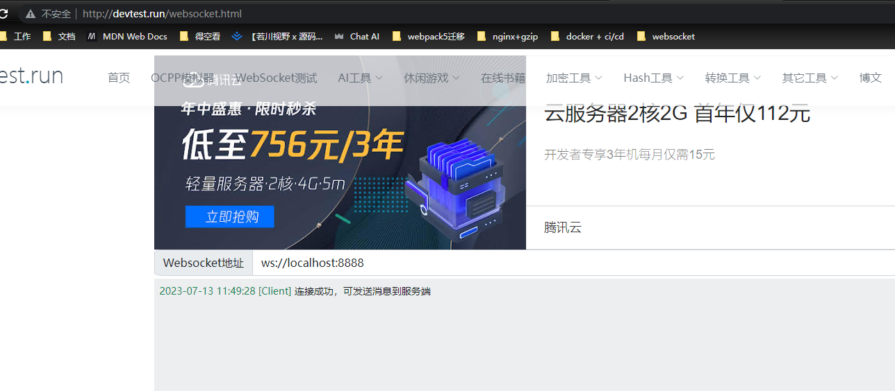
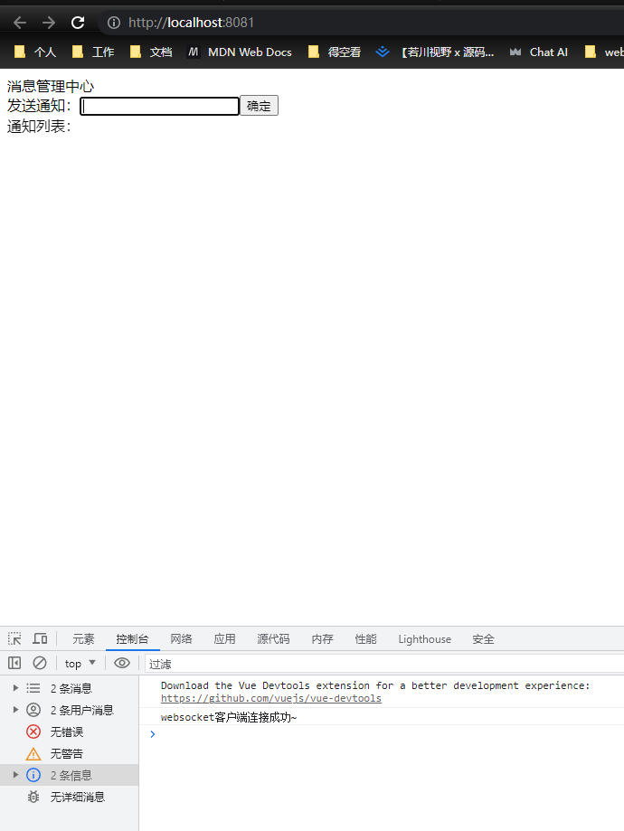
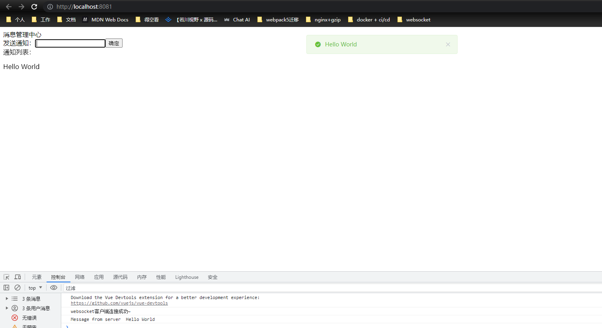

# WebSocket简单学习应用

## 仓库地址
https://github.com/Tandayuan/websocket-study

## 学习目标

- [x] 简单了解TCP、IP、HTTP、HTTPS知识
- [x] 简单了解WebSocket知识
- [x] 前端Vue+后端NodeJs模拟WebSocket使用场景

## 参考资料

+ [一文吃透 WebSocket 原理 刚面试完，趁热赶紧整理](https://juejin.cn/post/7020964728386093093#heading-3)

+ [万字长文，一文搞懂TCP、IP和HTTP、HTTPS](https://zhuanlan.zhihu.com/p/128000072)

+ [WebSoket在线调试工具](http://devtest.run/websocket.html)
+ [NodeJs应用WebSocket包ws npm](https://www.npmjs.com/package/ws)
+ [WebSocket的JsApi MDN](https://developer.mozilla.org/zh-CN/docs/Web/API/WebSocket)

## 简单了解TCP、IP、HTTP、HTTPS知识

## 简单了解WebSocket知识

<a href="#参考资料">点击跳转到对应文章查看即可获取知识</a>

## 前端Vue+后端NodeJs模拟WebSocket服务器使用场景

### 前端相关说明

+ 项目核心代码：[点击查看](./client-example/src/components/xiaoxi.vue)
+ 启动前端项目查看连接效果（建议先开启服务器的websocket）：`npm run serve`

### 后端服务器相关说明

+ 项目核心代码：[点击查看](./sever-example/index.js)

+ 启动服务器：`node .\sever-example\index.js`

### 展示效果

+ 打开`WebSoket在线调试工具`模拟一个客户端连接：

+ 前端页面又是一个客户端：

+ 在线调试工具客户端发送一条测试消息：`Hello World`
+ 前端客户端立即收到服务器推送的消息：

+ 也可以浏览器发送消息，在线调试工具接收消息
+ 展示完成~